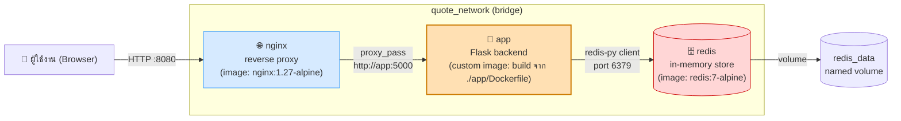

# Thai Quote of the Day — Docker Compose Project

โปรเจคสาธิตการใช้ Docker และ Docker Compose ประกอบด้วย 3 containers ที่ทำงานร่วมกัน:
- **nginx** — reverse proxy รับ request จากผู้ใช้ (official image)
- **app** — Flask backend ที่สุ่มคำคมภาษาไทย (**custom image ที่ build เองจาก Dockerfile**)
- **redis** — เก็บค่าสถิติการเข้าชม (official image)

## System Diagram



**คำอธิบาย flow:**
1. ผู้ใช้เปิดเบราว์เซอร์ไปที่ `http://localhost:8080`
2. `nginx` รับ request แล้วส่งต่อ (reverse proxy) ไปยัง service `app` ที่ port 5000
3. `app` (Flask) สุ่มคำคม แล้วเรียก `redis` เพื่อเพิ่มค่า counter และบันทึกคำคมล่าสุด
4. `redis` เก็บข้อมูลลง named volume `redis_data` เพื่อให้ข้อมูลไม่หายเมื่อ container restart
5. ทั้ง 3 containers สื่อสารกันภายใน custom network ชื่อ `quote_network`

## โครงสร้างไฟล์

```
thai-quote-project/
├── docker-compose.yml
├── README.md
├── app/
│   ├── Dockerfile          <- custom image (build เอง)
│   ├── app.py
│   ├── quotes.py
│   └── requirements.txt
└── nginx/
    └── nginx.conf
```

## วิธีรันโปรเจค

```bash
# 1) build image ทุกตัวใหม่หมด แบบไม่ใช้ cache (เพื่อให้เห็นทุก layer ตอน build)
docker compose build --no-cache

# 2) สั่งรันทุก container แบบ background
docker compose up -d

# 3) ดูสถานะ container ทั้งหมด
docker compose ps

# 4) ดู log แบบ real-time
docker compose logs -f

# 5) ทดสอบเปิดเว็บ
# เปิดเบราว์เซอร์ไปที่ http://localhost:8080
# หรือทดสอบผ่าน curl:
curl http://localhost:8080/api/quote

# 6) ปิดและลบ container ทั้งหมด (รวม network)
docker compose down

# 7) ถ้าต้องการลบ volume ข้อมูล redis ด้วย
docker compose down -v
```

## หมายเหตุสำหรับผู้ตรวจ / คลิปบรรยาย

- Dockerfile ของ service `app` (`./app/Dockerfile`) เป็น image ที่ build เองทั้งหมด ไม่ได้ copy มาจากที่อื่น
- ทุกไฟล์มี comment อธิบายรายละเอียดแต่ละบรรทัด/แต่ละส่วนกำกับไว้แล้ว
- ตอน build ให้ใช้ `docker compose build --no-cache` เพื่อให้เห็นการทำงานของทุก layer
